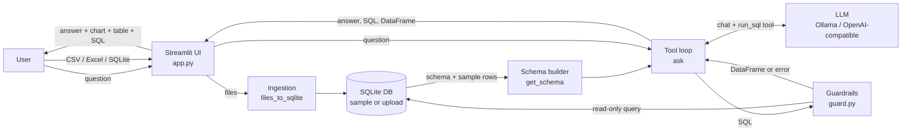
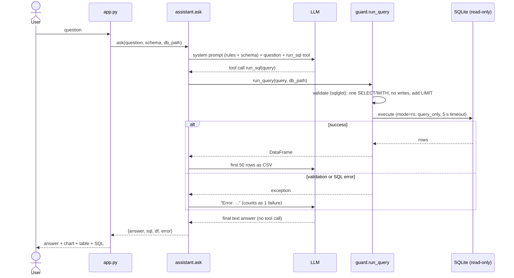
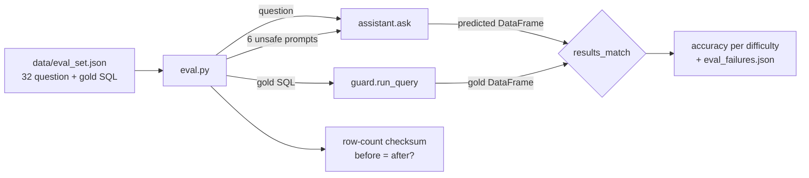

# Architecture

How the Natural-Language SQL Analytics Assistant turns a plain-English question into a safe SQL query, an answer, a chart and a table.

## 1. Overview



| Component | File | Responsibility |
|---|---|---|
| UI | `app.py` | Data-source choice, file upload, question box, picks the chart, renders results |
| Config | `assistant.py` (top) | Loads `.env`; sets `LLM_BASE_URL`, `LLM_API_KEY`, `LLM_MODEL` |
| Ingestion | `assistant.py` → `files_to_sqlite`, `is_sqlite`; `app.py` → `build_upload_db` | Turns uploads into one SQLite database |
| Schema builder | `assistant.py` → `get_schema` | Compact `CREATE TABLE` text with foreign keys and sample rows |
| Tool loop | `assistant.py` → `ask` | Talks to the LLM, runs its `run_sql` calls, handles retries |
| Guardrails | `guard.py` → `validate`, `run_query` | Allows only read-only SELECTs, enforces the row limit and timeout |
| Evaluation | `eval.py` | Execution accuracy on 32 question–SQL pairs, plus the unsafe-prompt check |

## 2. Inputs and outputs

### Inputs

| Input | Source | Format |
|---|---|---|
| Question | Text box in the UI, or the command line (`python assistant.py "..."`) | Free English text |
| Data | Sample `data/chinook.db`, or upload | `.csv`, `.xlsx`/`.xls`, or one `.db`/`.sqlite`/`.sqlite3` |
| LLM settings | `.env` or environment variables | `LLM_BASE_URL`, `LLM_API_KEY`, `LLM_MODEL` |

### Outputs

`ask()` returns a dict that the UI renders:

| Key | Type | Shown as |
|---|---|---|
| `answer` | `str` or `None` | Green box with a 1–3 sentence answer |
| `df` | `pandas.DataFrame` or `None` | Chart (when the shape fits) and a table |
| `sql` | `str` or `None` | "Generated SQL" expander |
| `error` | `str` or `None` | Red error box |

`df` and `sql` come from the **last query that succeeded**, so even when the model later fails to answer, the user can still see the data it got.

## 3. Request lifecycle



## 4. Stage by stage

### 4.1 Data ingestion (uploads only)

`app.py` → `build_upload_db(files)`:

1. Reads every uploaded file into memory.
2. If any file starts with the SQLite magic header (`SQLite format 3\0`):
   - more than one file uploaded → rejected ("Upload a SQLite database on its own...")
   - otherwise → written to a temp file and used as-is
3. Otherwise → `files_to_sqlite(files, path)`:
   - `.csv` → one table named after the file
   - `.xlsx`/`.xls` → one table per sheet (`<file>_<sheet>`, or just `<file>` when there is only one sheet)
   - anything else → `ValueError("Unsupported file type")`
4. Table and column names are cleaned into plain SQL names: lowercase, non-word characters become `_`, a leading digit gets a `t_` prefix, and duplicates get `_2`, `_3`.

   | Original | Stored as |
   |---|---|
   | `Sales 2024.csv` | `sales_2024` |
   | `Sales Amount ($)` | `sales_amount` |
   | `2024 Target` | `t_2024_target` |
   | `Total $`, `Total %` | `total`, `total_2` |

   Clean names matter because small models often forget to quote names that contain spaces or symbols.
5. The DB is rebuilt only when the set of uploaded files (name and size) changes; this is tracked in `st.session_state`.

### 4.2 Schema context

`get_schema(db_path)` opens the DB read-only and writes, for each table:

```sql
CREATE TABLE Invoice (
  InvoiceId INTEGER PRIMARY KEY,
  CustomerId INTEGER,
  InvoiceDate DATETIME,
  ...
  FOREIGN KEY (CustomerId) REFERENCES Customer(CustomerId)
);
/* sample rows:
InvoiceId | CustomerId | InvoiceDate | ...
1 | 2 | 2009-01-01 00:00:00 | ...
*/
```

- Sample rows show the model real value formats (date style, country spelling, ID ranges).
- Each sample value is cut to 50 characters, so long text columns don't fill the prompt.
- The Chinook schema is about 5.5k characters. The UI caches it per DB path with `st.cache_data`.

### 4.3 LLM tool loop

`ask()` uses the OpenAI-compatible Chat Completions API with one tool:

```json
{"name": "run_sql", "parameters": {"query": "A single SQLite SELECT statement."}}
```

The system prompt tells the model to:
- answer by calling `run_sql`
- use only the tables in the schema
- alias computed columns
- fix the SQL and call again when it gets an error
- finish with a short plain-English answer, or say the question can't be answered from this data

Loop rules:

| Rule | Value | Why |
|---|---|---|
| Failed SQL attempts allowed | `MAX_RETRIES = 2` (3 tries in total) | Lets the model fix typos and wrong column names |
| Model turns per question | `MAX_TURNS = 6` | Stops small models that keep calling the tool and never answer |
| Rows sent back to the model | First 50, as CSV | Keeps the context small; the UI still shows every row (up to 1000) |
| Failures counted | Bad tool-call JSON, guardrail rejection, SQLite error | All three are "the model's SQL didn't work" |
| Answer cleanup | `<think>...</think>` removed | Some local reasoning models (e.g. qwen3) put their reasoning in the reply |

### 4.4 Guardrails

Three independent layers protect the data, so one failing doesn't expose it:

| Layer | Where | What it stops |
|---|---|---|
| 1. SQL validation | `guard.validate` (sqlglot AST) | Anything other than exactly one `SELECT`/`WITH`/`UNION` query, and any nested `INSERT`, `UPDATE`, `DELETE`, `DROP`, `CREATE`, `ALTER`, `PRAGMA` or command such as `ATTACH`. SQL that doesn't parse is rejected too. |
| 2. Read-only connection | `sqlite3.connect("file:...?mode=ro")` + `PRAGMA query_only = ON` | Any write that somehow got past layer 1 |
| 3. Resource limits | `LIMIT 1000` appended when missing; progress handler aborts after 5 s | Huge result sets and runaway joins |

`python guard.py` checks these layers: 10 unsafe statements must be rejected, the limit must be applied, a 3-way cross join must time out, and the data must stay unchanged.

### 4.5 Result display

`chart_spec(df)` in `app.py` chooses the chart:

| Result shape | Chart |
|---|---|
| Fewer than 2 rows, or no numeric column, or no text/date column | Table only |
| First non-numeric column parses as dates (e.g. `2012-01`) | Line chart of all numeric columns |
| Otherwise | Bar chart of the first numeric column, first 50 rows, in the query's own order |

## 5. Configuration

`.env` is read at import time by a short built-in loader (no extra dependency). Real environment variables take precedence over it.

```
LLM_BASE_URL=http://localhost:11434/v1   # Ollama (default)
LLM_API_KEY=ollama
LLM_MODEL=qwen3:1.7b
```

The code sends only standard Chat Completions fields (`model`, `messages`, `tools`), so it works with Ollama, OpenAI, Groq, Gemini, Claude, LM Studio, vLLM and similar servers without changes.

## 6. Error handling

| Failure | Where it is caught | What the user sees |
|---|---|---|
| Bad SQL / unknown column | `ask` → sent back to the model | Nothing; the model retries |
| More than 2 failed SQL attempts | `ask` | "Query failed after 2 retries: <last error>" |
| Model never gives a final answer | `ask` (`MAX_TURNS`) | "No final answer after 6 model turns." |
| LLM unreachable / wrong key / rate limit | `app.py` try/except | Error box with the exception name and message |
| Bad upload (wrong type, SQLite mixed with CSV, unreadable file) | `app.py` | "Could not load the files: ..." |
| No data uploaded yet | `app.py` | Info message; the question box is hidden |

## 7. Evaluation pipeline



- **Match rule:** same row count, and every gold column appears among the predicted columns, compared as sorted values rounded to 2 decimals. Row order, column names and extra columns are ignored.
- **`--no-retry`:** runs with `max_retries=0` to measure how much self-correction helps.
- **Safety check:** a checksum over customer, invoice and artist counts plus the total track price, taken before and after the unsafe prompts.

## 8. Security and privacy

- Every query runs on a read-only connection, so uploaded and sample data cannot be changed.
- The model never runs code. It can only propose SQL, which is validated before it executes.
- What leaves the machine: the schema, 3 sample rows per table, the question, and up to 50 result rows per query go to the configured LLM endpoint. With Ollama (the default), nothing leaves the machine.
- Uploaded files are stored in the OS temp folder (`nlsql_*`) and are not deleted automatically.
- `.env` (API keys) is git-ignored. Only `.env.example` is committed.

## 9. Design decisions

| Decision | Alternative | Reason |
|---|---|---|
| Function calling (`run_sql` tool) | Ask for SQL in a code block and parse it | No parsing; error-and-retry fits naturally into the conversation |
| OpenAI-compatible API | One vendor's SDK | Any provider, local or hosted, by editing `.env` |
| Everything goes into SQLite (uploads included) | Query pandas DataFrames directly | One SQL dialect, one guard path and one schema builder for every data source |
| Validate with sqlglot, then a read-only connection | Regex blocklist | A regex blocklist is easy to bypass. Parsing the SQL tree plus a read-only connection gives two independent layers |
| Whole schema in the prompt | Retrieve only the relevant tables | Simple and accurate at this size. Retrieval only becomes worth it with hundreds of tables |
| Small hand-written eval set | Spider / BIRD benchmarks | Tests this database and these question types directly, and runs in minutes |

## 10. Extending

| To add | Where |
|---|---|
| Another upload format (e.g. Parquet, JSON) | Add an `elif ext == ...` branch in `files_to_sqlite` |
| Postgres / MySQL | Swap the connection in `guard.run_query` and `get_schema`; set `read="postgres"` in `validate` |
| Follow-up questions | Keep `messages` in `st.session_state` and pass earlier turns to `ask` |
| Larger schemas | Before building the prompt, pick the relevant tables (e.g. by matching names against the question) |
| Temp-file cleanup | Delete the `nlsql_*` folder when the session ends or the upload changes |
